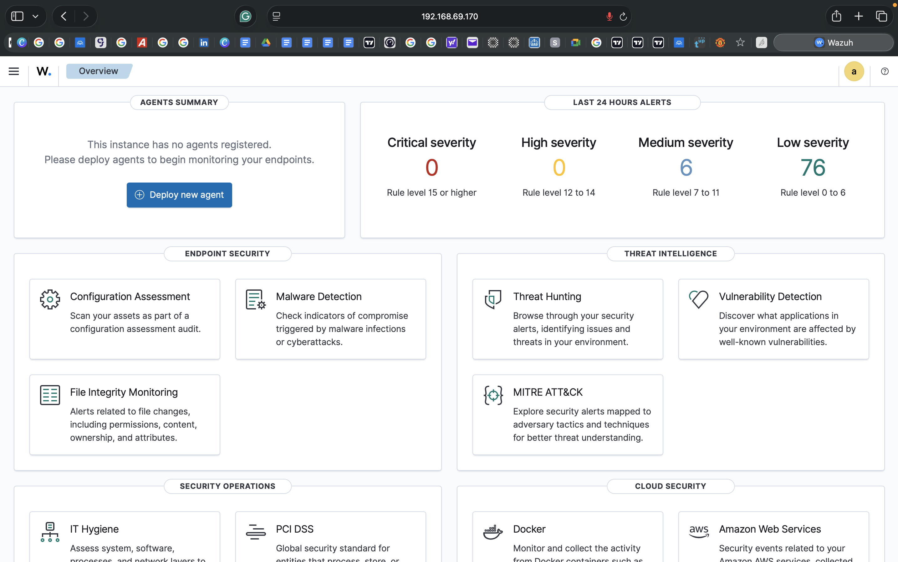
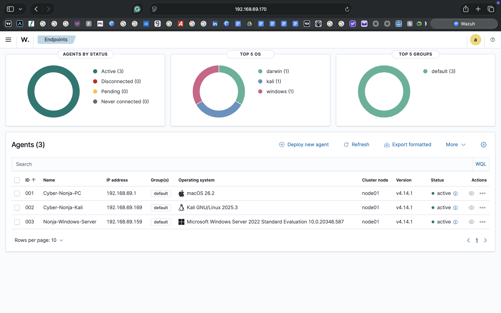
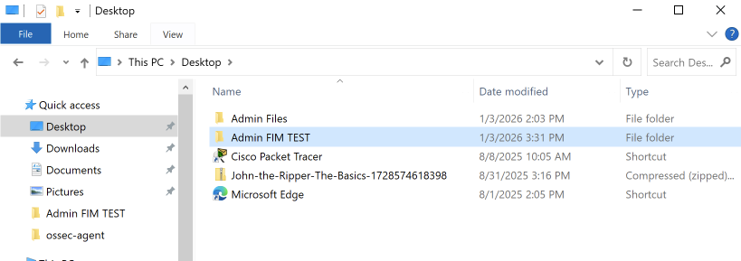
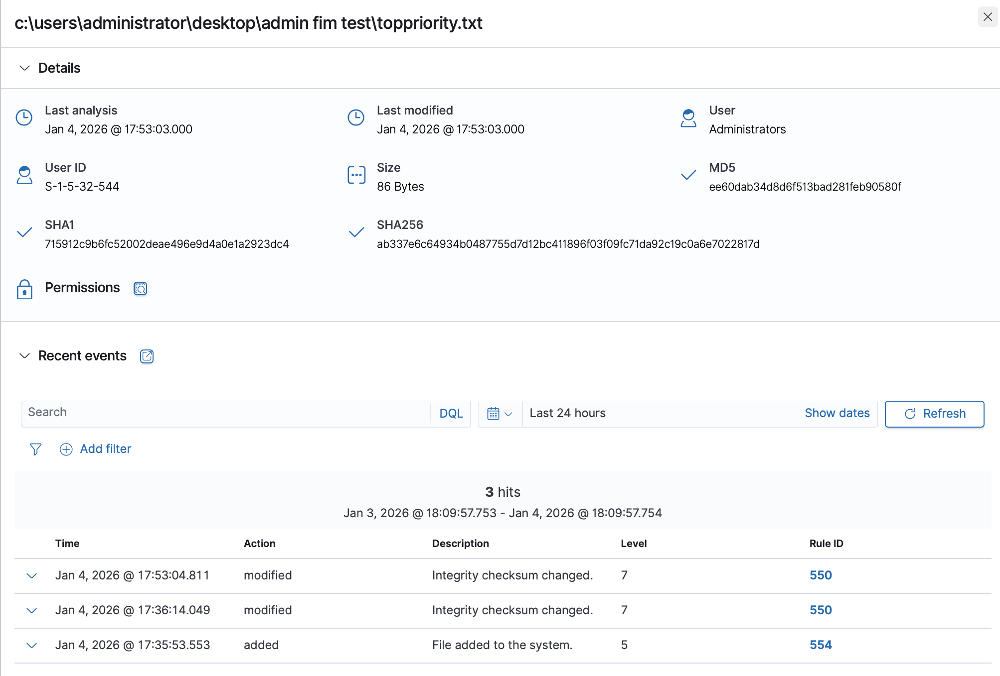
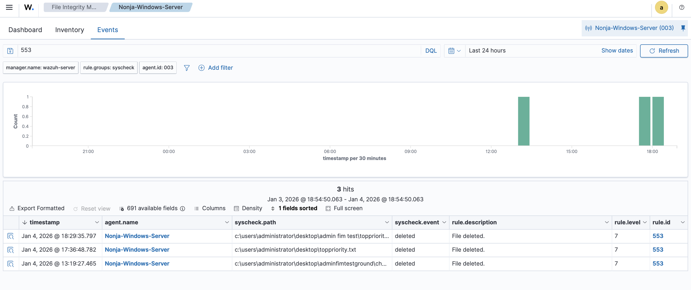
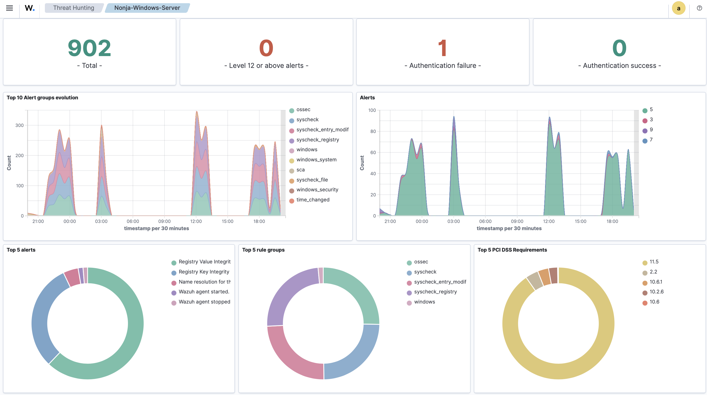
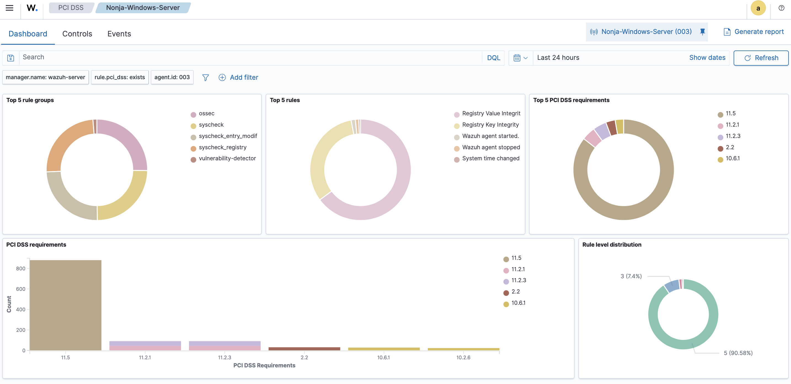
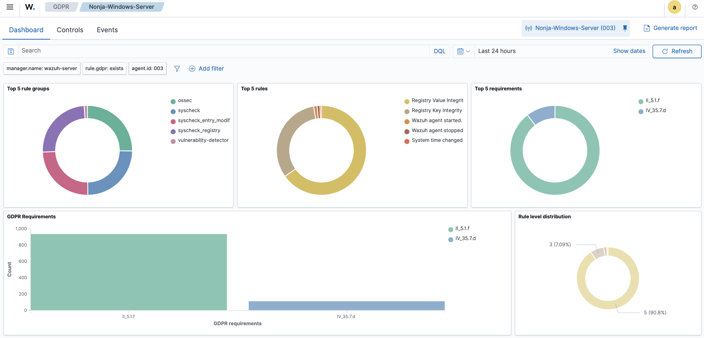

# Wazuh SIEM Deployment & Endpoint Monitoring

**Deploying Wazuh SIEM and implementing File Integrity Monitoring (FIM) on Windows Server.**  
Built and documented in a VMware Fusion virtual lab. Dated: 4th January 2026.

-----

## What This Project Does

This project deploys a full Wazuh Security Information and Event Management (SIEM) environment from scratch using an OVA image on VMware Fusion. Wazuh agents are installed on Windows Server 2022 and Kali Linux endpoints. File Integrity Monitoring is configured on the Windows Server to detect and alert on file creation, modification, and deletion in real time. Security events are mapped to GDPR and PCI DSS compliance requirements directly in the Wazuh dashboard.

-----

## Lab Environment

|Component     |Details                         |
|--------------|--------------------------------|
|Host Machine  |macOS (MacBook)                 |
|Virtualisation|VMware Fusion                   |
|SIEM Platform |Wazuh All-in-One (OVA — v4.14.1)|
|Endpoint 1    |Windows Server 2022             |
|Endpoint 2    |Kali Linux                      |
|Network Mode  |NAT / Bridged                   |

-----

## Architecture

```
Wazuh Manager (OVA on VMware Fusion — 192.168.69.170)
        |
        ├── Agent 001: Cyber-Nonja-PC (macOS 26.2) — Active
        ├── Agent 002: Cyber-Nonja-Kali (Kali Linux 2025.3) — Active
        └── Agent 003: Nonja-Windows-Server (Windows Server 2022) — Active
                        |
                        └── FIM configured on: C:\Users\Administrator\Desktop\
```

-----

## What I Built

### 1. Deployed Wazuh Manager via OVA

- Downloaded the official Wazuh All-in-One OVA
- Imported into VMware Fusion, allocated CPU/memory, configured networking
- Verified all three services running: `wazuh-manager`, `wazuh-indexer`, `wazuh-dashboard`
- Accessed the dashboard via browser at `https://192.168.69.170`

### 2. Installed Wazuh Agents on Endpoints

**Windows Server 2022:**

- Used the Wazuh Dashboard deployment wizard
- Ran the generated PowerShell command as Administrator
- Started the agent service: `NET START Wazuh`

**Kali Linux:**

- Selected Debian/Ubuntu (amd64) in the wizard
- Ran the install command with `sudo`
- Started the agent: `sudo systemctl enable wazuh-agent && sudo systemctl start wazuh-agent`

All three agents confirmed **Active** in the dashboard.

### 3. Configured File Integrity Monitoring (FIM)

Edited `ossec.conf` on the Windows Server endpoint:

```xml
<!-- File integrity monitoring -->
<syscheck>
  <disabled>no</disabled>
  <!-- Frequency changed to 2 minutes for faster detection -->
  <frequency>120</frequency>

  <directories check_all="yes" report_changes="yes" realtime="yes">
    C:\Users\Administrator\Desktop\
  </directories>
</syscheck>
```

### 4. Tested FIM Detection

- Created a folder and file (`TopPriority.txt`) on the Desktop → **added** event logged (Rule 554)
- Modified the file content → **Integrity checksum changed** logged (Rule 550)
- Deleted the file → **deleted** event logged (Rule 553)
- Verified all three events in the Wazuh FIM Inventory and Events tabs

### 5. Reviewed Compliance Mappings

**PCI DSS:** Most events mapped to Requirement 11.5 (file and registry integrity monitoring). Additional events mapped to 11.2 and 10.6. All alerts classified low-to-medium severity.

**GDPR:** File integrity and system change events automatically correlated with applicable GDPR articles via Wazuh’s rule-based classification engine.

-----

## Key Evidence

|Evidence                      |Description                                                  |
|------------------------------|-------------------------------------------------------------|
|`wazuh-dashboard-login.png`   |Wazuh dashboard accessed at 192.168.69.170                   |
|`agents-active.png`           |All 3 agents showing Active status                           |
|`fim-file-added.png`          |FIM detecting TopPriority.txt creation (Rule 554)            |
|`fim-checksum-changed.png`    |Integrity checksum changed after file modification (Rule 550)|
|`fim-file-deleted.png`        |File deletion event logged (Rule 553)                        |
|`threat-hunting-dashboard.png`|902 total events, 0 high-severity alerts                     |
|`pci-dss-dashboard.png`       |Events mapped to PCI DSS Requirement 11.5                    |
|`gdpr-dashboard.png`          |Events mapped to GDPR articles                               |

*All screenshots are in the `/screenshots` folder.*

-----

## Screenshots

**Wazuh Dashboard Login**


**Agents Active**


**FIM — File Added**


**FIM — Checksum Changed**


**FIM — File Deleted**


**Threat Hunting Dashboard**


**PCI DSS Dashboard**


**GDPR Dashboard**


-----

## Findings

- FIM successfully detected all three event types — creation, modification, deletion — with accurate timestamps and file hashes (MD5, SHA1, SHA256)
- 902 total events recorded across the monitoring period with zero high-severity (Level 12+) alerts
- Wazuh automatically mapped events to PCI DSS Requirement 11.5 and relevant GDPR articles without manual configuration
- `realtime="yes"` and `report_changes="yes"` in ossec.conf are essential for near-instant detection — without these, changes are only picked up at the next scheduled scan

-----

## Conclusion

This lab validates Wazuh as a production-capable open-source SIEM. Agent deployment, FIM configuration, event detection, and compliance mapping all worked correctly. The setup is directly applicable to real SOC workflows — endpoint monitoring, alert triage, and regulatory reporting are all covered in a single platform.

-----

## Full Guide

The complete step-by-step deployment guide is available in [`wazuh-siem-deployment-guide.pdf`](./wazuh-siem-deployment-guide.pdf).

-----

*Part of my cybersecurity portfolio — [github.com/Bigmykeb](https://github.com/bigmyk-e)*
